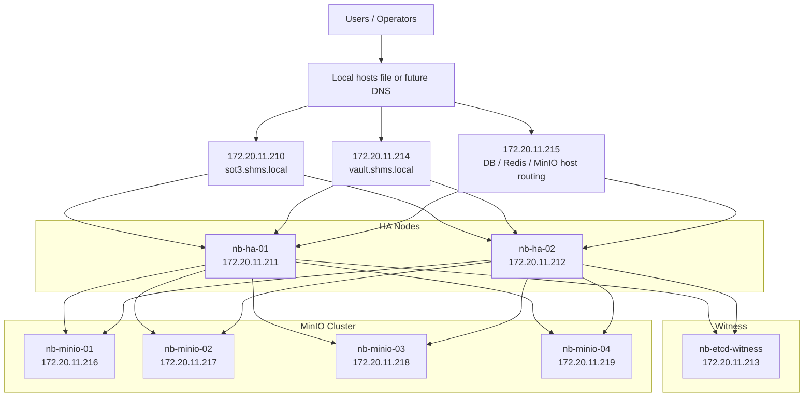
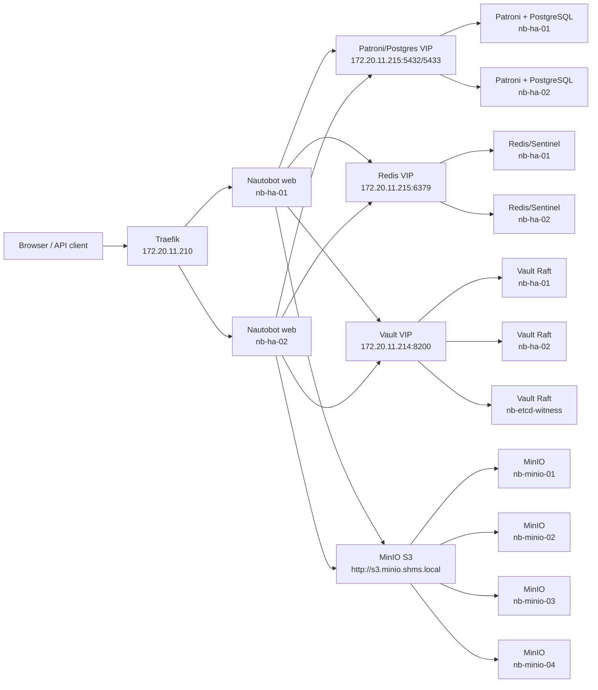
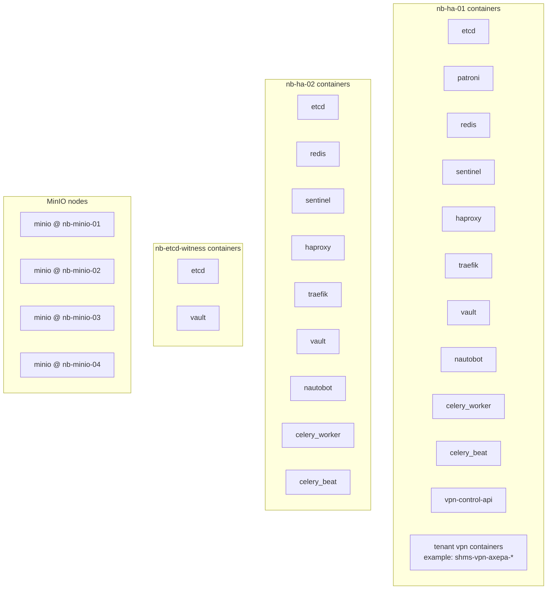

# SHMS Nautobot HA As-Built Reference

> Standalone technical reference for the SHMS Nautobot HA deployment.
> Audience: engineers and LLM agents who need to operate, extend, or debug the environment without relying on conversational history.
> As-built snapshot date: `2026-04-22` (Europe/Athens).

## 1. Document Intent

This document captures the **implemented** SHMS Nautobot HA environment as it exists today, plus the known gaps and backlog items that remain open.

It is intended to answer all of the following without external context:

- what was originally planned
- what was actually deployed
- where the authoritative source repository lives
- how to SSH into every node
- where the live deployed tree is on each node
- how the HA/VIP model works
- how MinIO, Vault, Patroni, Redis, Traefik, and Nautobot fit together
- which custom plugins, jobs, repos, and runtime patches are in use
- which parts of the migration from `wyze` are complete
- which parts remain blocked
- what an engineer or LLM should touch first for each subsystem

This document is deliberately redundant in places. The goal is not brevity. The goal is operational clarity.

## 2. Original Design Sources

The deployment started from these Joplin notes:

- `8fcacac18ac84f85bf82efe6226ed7af`
  - `Nautobot v3 HA — Hardware Sizing & Specifications`
- `9d5552a7af2646e0a8b73cd6e020fe29`
  - `Nautobot v3 HA — Engineer Deployment Guide (Patroni + MinIO, NFS-free)`

Current project tracking URL:

- [Plane Project Tracker](https://plane.nstam.eu/sh/projects/d42147ff-a5d6-4ccd-91ba-ddf6e9e4f067/issues)

This reference is **standalone** and should be treated as the primary as-built operational document. The Joplin notes and Plane project remain important provenance and backlog sources.

## 3. Current State Summary

### 3.1 What is implemented

Core platform:

- upstream-based Nautobot `3.1.0` deployment tree
- two Nautobot app nodes:
  - `nb-ha-01`
  - `nb-ha-02`
- 3-node etcd cluster
- 2-node Patroni/PostgreSQL cluster
- Redis + Sentinel HA
- HAProxy + Keepalived VIPs
- Traefik for the Nautobot web entrypoint
- 3-node Vault Raft cluster
- 4-node MinIO cluster
- Nautobot storage cut over to MinIO S3
- LDAP/AD authentication enabled
- tenant/capability RBAC model implemented
- major `wyze` customizations migrated:
  - custom apps
  - jobs repo integration
  - DB-backed extensibility objects
  - tenants / locations / platforms

Live object counts from Nautobot on `nb-ha-01`:

- tenants: `9`
- locations: `56`
- platforms: `23`
- Git repositories: `7`
- jobs: `115`

### 3.2 What is validated

Validated:

- app VIP failover between `nb-ha-01` and `nb-ha-02`
- MinIO single-node resilience during Nautobot S3 traffic
- Vault VIP restored and reachable from both HA nodes and Nautobot containers
- AD login path working
- RBAC path working after constraint-model rewrite

### 3.3 What is still open

Still open / incomplete:

- VPN runtime is **partially implemented but operationally blocked**
  - outbound customer VPN establishment is still blocked by network/proxy/trust conditions
  - control plane exists, but the tunnel lifecycle is not production-ready
- DNS A records are not fully published
  - `/etc/hosts` entries are still required
- some runtime patch noise remains in management command output
- Celery health state is not clean on both HA nodes
  - app functionality is working
  - health reporting is still noisy / partially unhealthy
- some backlog parity items remain intentionally deferred
  - e.g. Meraki-related integration work

## 4. Node Inventory

### 4.1 Hostnames and IPs

| Role | Hostname | IP |
|---|---|---|
| Nautobot HA node 1 | `nb-ha-01` | `172.20.11.211` |
| Nautobot HA node 2 | `nb-ha-02` | `172.20.11.212` |
| etcd/Vault witness | `nb-etcd-witness` | `172.20.11.213` |
| MinIO node 1 | `nb-minio-01` | `172.20.11.216` |
| MinIO node 2 | `nb-minio-02` | `172.20.11.217` |
| MinIO node 3 | `nb-minio-03` | `172.20.11.218` |
| MinIO node 4 | `nb-minio-04` | `172.20.11.219` |

### 4.2 VIPs

| VIP | IP | Purpose |
|---|---|---|
| App VIP | `172.20.11.210` | Traefik-published Nautobot |
| Vault VIP | `172.20.11.214` | Vault API/UI |
| Infra VIP | `172.20.11.215` | DB, Redis, S3/Console host-based HAProxy fronting |

### 4.3 Current VIP ownership

At the time of writing, `nb-ha-01` currently holds:

- `172.20.11.210`
- `172.20.11.214`
- `172.20.11.215`

This is normal. Ownership is expected to move on health-driven failover.

## 5. Access Model

### 5.1 SSH access

All project hosts are reachable directly via SSH alias:

- `nb-ha-01`
- `nb-ha-02`
- `nb-etcd-witness`
- `nb-minio-01`
- `nb-minio-02`
- `nb-minio-03`
- `nb-minio-04`

Examples:

```bash
ssh nb-ha-01
ssh nb-ha-02
ssh nb-minio-01
```

The expected operator account is `nstam` with passwordless sudo.

### 5.2 Required temporary `/etc/hosts` block

Until DNS A records are published, use this block:

```hosts
172.20.11.210 sot3.shms.local
172.20.11.211 nb-ha-01.shms.local nb-ha-01
172.20.11.212 nb-ha-02.shms.local nb-ha-02
172.20.11.213 nb-etcd-witness.shms.local nb-etcd-witness
172.20.11.214 vault.shms.local
172.20.11.215 nb-db-vip.shms.local nb-redis-vip.shms.local console.minio.shms.local s3.minio.shms.local
172.20.11.216 nb-minio-01.shms.local nb-minio-01
172.20.11.217 nb-minio-02.shms.local nb-minio-02
172.20.11.218 nb-minio-03.shms.local nb-minio-03
172.20.11.219 nb-minio-04.shms.local nb-minio-04
```

Do **not** rely on `minio.shms.local`. It is legacy and semantically ambiguous.

### 5.3 Secrets handling

Live secrets are not documented inline here. They exist in:

- local artifacts:
  - `/opt/_tools/_automation/__codex_tmp_project__/artifacts/nautobot-shms-secrets.kdbx`
  - `/opt/_tools/_automation/__codex_tmp_project__/artifacts/nautobot-shms-secrets.csv`
  - `/opt/_tools/_automation/__codex_tmp_project__/artifacts/nautobot-shms-secret-values.env`
  - `/opt/_tools/_automation/__codex_tmp_project__/artifacts/nautobot-shms-endpoints.xlsx`
  - `/opt/_tools/_automation/__codex_tmp_project__/artifacts/nautobot-shms-endpoints.csv`
- Vault:
  - `secret/shms/credentials/*`
  - `secret/shms/inventory/endpoints`
  - legacy migrated KV data under `kv/`

If an engineer or LLM needs secrets, the correct access path is:

1. prefer Vault
2. fall back to the artifact bundle only when necessary

## 6. Source Repository and Live Deployment Trees

### 6.1 Authoritative local source tree

Primary working repository:

- `/opt/_tools/_automation/__codex_tmp_project__/nautobot-docker-compose-upstream`

This is the as-built overlay on top of upstream `nautobot-docker-compose`.

Top-level related deployment scripts outside the upstream tree:

- `/opt/_tools/_automation/__codex_tmp_project__/bootstrap_shms_nodes.sh`
- `/opt/_tools/_automation/__codex_tmp_project__/deploy_etcd_shms.sh`
- `/opt/_tools/_automation/__codex_tmp_project__/deploy_patroni_shms.sh`
- `/opt/_tools/_automation/__codex_tmp_project__/deploy_redis_haproxy_keepalived.sh`
- `/opt/_tools/_automation/__codex_tmp_project__/deploy_traefik_http.sh`
- `/opt/_tools/_automation/__codex_tmp_project__/deploy_vault_ha.sh`
- `/opt/_tools/_automation/__codex_tmp_project__/deploy_minio_shms.sh`
- `/opt/_tools/_automation/__codex_tmp_project__/migrate_vault_kv.py`

### 6.2 Live deployed Nautobot tree on HA nodes

Live deployed tree on both HA nodes:

- `/opt/nautobot`

This contains:

- app config
- environments
- custom plugins
- local jobs
- runtime patches
- VPN control-plane code

### 6.3 Live Git-synced Nautobot repositories

On `nb-ha-01`, Nautobot GitRepository syncs clone into:

- `/opt/nautobot/git/devicetype_library`
- `/opt/nautobot/git/shms_nautobot_backup_repo`
- `/opt/nautobot/git/shms_nautobot_command_mappers_repo`
- `/opt/nautobot/git/shms_nautobot_config_context_repo`
- `/opt/nautobot/git/shms_nautobot_intended_repo`
- `/opt/nautobot/git/shms_nautobot_jobs_repo`
- `/opt/nautobot/git/shms_nautobot_template_repo`

Live Nautobot GitRepository records:

| Name | Remote URL | Branch |
|---|---|---|
| `Devicetype-library` | `https://github.com/nstamoul/devicetype-library.git` | `master` |
| `SHMS_nautobot_backup_repo` | `http://git.shms.local/nstam/nautobot_backup_repo.git` | `main` |
| `SHMS_nautobot_command_mappers_repo` | `http://git.shms.local/nstam/nautobot_command_mappers_repo.git` | `main` |
| `SHMS_nautobot_config_context_repo` | `http://git.shms.local/nstam/nautobot_config_context_repo.git` | `main` |
| `SHMS_nautobot_intended_repo` | `http://git.shms.local/nstam/nautobot_intended_repo.git` | `main` |
| `SHMS_nautobot_jobs_repo` | `http://git.shms.local/nstam/nautobot_jobs_repo.git` | `nautobot3-main` |
| `SHMS_nautobot_template_repo` | `http://git.shms.local/nstam/nautobot_template_repo.git` | `main` |

### 6.4 SHMS-only local jobs

Intentional local jobs on the deployed tree:

- `/opt/nautobot/jobs/day7_validation.py`
- `/opt/nautobot/jobs/vpn_queue_reconciliation.py`
- `/opt/nautobot/jobs/__init__.py`

These are local by design.

Historical overlap between local jobs and Git jobs was cleaned up. The audit artifact is:

- `/opt/_tools/_automation/__codex_tmp_project__/artifacts/shms_job_overlap_audit.md`

## 7. Implemented Architecture

### 7.1 Physical / host-level architecture



### 7.2 Logical service architecture



### 7.3 Docker/container-level composition



## 8. Subsystem-by-Subsystem Status

### 8.1 Base node bootstrap

Bootstrap script:

- `/opt/_tools/_automation/__codex_tmp_project__/bootstrap_shms_nodes.sh`

What it does:

- hostname normalization
- `/etc/hosts` injection
- base packages
- Docker and containerd
- proxy-aware systemd drop-ins
- chrony
- `nstam` in docker group

MinIO nodes were later prepared separately but follow the same operational model:

- `nstam` user exists
- passwordless sudo exists
- Docker installed
- Tailscale installed manually from local package bundle

### 8.2 etcd

Deployment script:

- `/opt/_tools/_automation/__codex_tmp_project__/deploy_etcd_shms.sh`

Topology:

- `nb-ha-01`
- `nb-ha-02`
- `nb-etcd-witness`

Image:

- `quay.io/coreos/etcd:v3.5.15`

Data paths:

- `nb-ha-01`: `/data/etcd`
- `nb-ha-02`: `/data/etcd`
- `nb-etcd-witness`: `/var/lib/etcd`

Status:

- deployed
- healthy

### 8.3 Patroni / PostgreSQL

Deployment script:

- `/opt/_tools/_automation/__codex_tmp_project__/deploy_patroni_shms.sh`

Image:

- `ghcr.io/zalando/spilo-16:3.3-p3`

Topology:

- `nb-ha-01`
- `nb-ha-02`

Data path:

- `/data/postgres`

VIP access:

- primary: `postgresql://nb-db-vip.shms.local:5432/nautobot`
- replica: `postgresql://nb-db-vip.shms.local:5433/nautobot`

Notes:

- PostgreSQL database `nautobot` and DB role `nautobot` are provisioned by the deployment script
- Patroni REST API is used by HAProxy health checks

Status:

- deployed
- HA VIP in place
- app connectivity working

### 8.4 Redis / Sentinel / HAProxy / Keepalived

Deployment script:

- `/opt/_tools/_automation/__codex_tmp_project__/deploy_redis_haproxy_keepalived.sh`

What it fronts:

- Redis VIP
- PostgreSQL VIP
- MinIO S3 and MinIO console host-based routing on `172.20.11.215`

Important behavior:

- HAProxy binds:
  - `172.20.11.215:80`
  - `172.20.11.215:9000`
  - `172.20.11.215:9001`
- host-based routing on port `80` currently distinguishes:
  - `s3.minio.shms.local`
  - `console.minio.shms.local`

Keepalived owns three VIPs:

- `172.20.11.210` app
- `172.20.11.214` vault
- `172.20.11.215` infra

Status:

- deployed
- failover logic validated for app VIP
- MinIO VIP path functional

### 8.5 Traefik

Deployment script:

- `/opt/_tools/_automation/__codex_tmp_project__/deploy_traefik_http.sh`

Published hostname:

- `sot3.shms.local`

Bind model:

- `172.20.11.210:80`

Backend model:

- routes to local Nautobot app listener at `http://127.0.0.1:8081`

Status:

- deployed on both HA nodes
- app VIP failover validated by stopping Traefik on the primary and confirming `200 OK` from the failover node

### 8.6 Nautobot app tier

Authoritative source tree:

- `/opt/_tools/_automation/__codex_tmp_project__/nautobot-docker-compose-upstream`

Deployment script:

- `/opt/_tools/_automation/__codex_tmp_project__/nautobot-docker-compose-upstream/deploy_shms_upstream_node1.sh`

Live deployment path:

- `/opt/nautobot`

Current live containers:

- on `nb-ha-01`
  - `nautobot`
  - `celery_worker`
  - `celery_beat`
- on `nb-ha-02`
  - `nautobot`
  - `celery_worker`
  - `celery_beat`

Important note:

The **intended** model originally favored one active app node first, then node 2 after shared storage. Shared storage now exists and node 2 is active.

However, live state currently includes `celery_beat` on both nodes. That is materially different from a strict single-beat model and should be treated as a review point. Duplicate scheduled execution risk must be considered unless this is intentionally managed elsewhere.

Current live health observations:

- web containers are healthy
- Celery health is noisy / not fully clean

This should be documented as technical debt, not ignored.

### 8.7 MinIO

Deployment script:

- `/opt/_tools/_automation/__codex_tmp_project__/deploy_minio_shms.sh`

Cluster nodes:

- `nb-minio-01`
- `nb-minio-02`
- `nb-minio-03`
- `nb-minio-04`

Image:

- `quay.io/minio/minio:latest`

Data path on each node:

- `/minio/data`

URLs:

- console:
  - `http://console.minio.shms.local/`
- S3:
  - `http://s3.minio.shms.local`

Legacy direct paths still exist:

- `http://172.20.11.215:9000`
- `http://172.20.11.215:9001`

Nautobot storage:

- enabled in `nautobot_config.py`
- uses `storages.backends.s3.S3Storage`
- bucket:
  - `nautobot`
- locations:
  - `media`
  - `job-files`

Status:

- deployed
- healthy on all four nodes
- one-node failure tested while Nautobot S3 operations still succeeded

### 8.8 Vault

Deployment script:

- `/opt/_tools/_automation/__codex_tmp_project__/deploy_vault_ha.sh`

Cluster:

- `nb-ha-01`
- `nb-ha-02`
- `nb-etcd-witness`

Storage backend:

- integrated storage / Raft

VIP:

- `https://vault.shms.local:8200`

Certificate material:

- `/opt/_tools/_automation/__codex_tmp_project__/artifacts/vault/pki/`

Key facts:

- Vault availability is critical to:
  - Nautobot secret resolution
  - GitRepository secret-provider access
  - VPN credential resolution
- Vault may require manual unseal after full reboot/failover recovery events

Policy/material artifacts:

- `/opt/_tools/_automation/__codex_tmp_project__/artifacts/vault/nautobot-policy.hcl`
- `/opt/_tools/_automation/__codex_tmp_project__/artifacts/vault/vault-init.json`

Status:

- deployed
- VIP restored and currently reachable
- credential inventory re-uploaded

### 8.9 LDAP / AD

Primary config:

- `/opt/_tools/_automation/__codex_tmp_project__/nautobot-docker-compose-upstream/config/nautobot_config.py`
- `/opt/_tools/_automation/__codex_tmp_project__/nautobot-docker-compose-upstream/docs/SHMS_RBAC_AD_SPEC.md`
- `/opt/_tools/_automation/__codex_tmp_project__/nautobot-docker-compose-upstream/scripts/bootstrap_shms_rbac.py`
- `/opt/_tools/_automation/__codex_tmp_project__/nautobot-docker-compose-upstream/scripts/create_shms_ad_rbac_groups.ps1`
- `/opt/_tools/_automation/__codex_tmp_project__/nautobot-docker-compose-upstream/scripts/create_shms_ad_rbac_examples.ps1`

LDAP server:

- `ldap://172.20.11.30`

Current model:

- `NB-LOGIN`
- `NB-STAFF`
- `NB-SUPERUSERS`
- composite tenant/capability groups:
  - `NB-<TENANT>-OPS-USERS`
  - `NB-<TENANT>-OPS-ADMINS`
  - `NB-<TENANT>-NONOPS-USERS`
  - `NB-<TENANT>-NONOPS-ADMINS`

Important implementation note:

- `Tenant` scoping in this SHMS Nautobot build uses `tenant__name`, not `tenant__slug`

Important runtime note:

- `ldap_superuser_staff_fix.py` exists because a user mapped to superuser but not staff caused portions of the Nautobot UI to disappear

### 8.10 MinIO-backed file storage

Storage config is in:

- `/opt/_tools/_automation/__codex_tmp_project__/nautobot-docker-compose-upstream/config/nautobot_config.py`

Backends switched:

- `STORAGES["default"]`
- `STORAGES["nautobotjobfiles"]`

Endpoint:

- `http://s3.minio.shms.local`

Status:

- complete
- verified by real Nautobot S3 operations

## 9. Nautobot Customizations

### 9.1 Python dependencies / plugin set

Key dependencies from:

- `/opt/_tools/_automation/__codex_tmp_project__/nautobot-docker-compose-upstream/pyproject.toml`

Key SHMS plugin dependencies:

- `nautobot-welcome-wizard`
- `nautobot-device-onboarding`
- `nautobot-ssot`
- `nautobot-device-lifecycle-mgmt`
- `nautobot-secrets-providers[hashicorp]`
- `nautobot-capacity-metrics`
- `nautobot-golden-config`
- `nautobot-software-lifecycle`
- `nautobot-ui-plugin`
- `nautobot-connectivity-matrix`
- `nbcot`
- `nautobot-vpn-manager`
- `nautobot-plugin-nornir`
- `ns-helper-functions`
- `ns-nornir-table-inventory`

### 9.2 Custom apps carried over

Implemented / present:

- `nautobot-connectivity-matrix`
- `nautobot_ui_plugin`
- `nbcot`
- `nautobot_software_lifecycle`
- `nautobot_vpn_manager`

Relevant paths:

- `/opt/_tools/_automation/__codex_tmp_project__/nautobot-docker-compose-upstream/plugins/nautobot-app-nautobot-connectivity-matrix`
- `/opt/_tools/_automation/__codex_tmp_project__/nautobot-docker-compose-upstream/plugins/nautobot_ui_plugin`
- `/opt/_tools/_automation/__codex_tmp_project__/nautobot-docker-compose-upstream/plugins/nautobot-app-nbcot`
- `/opt/_tools/_automation/__codex_tmp_project__/nautobot-docker-compose-upstream/plugins/nautobot-app-nautobot_software_lifecycle`
- `/opt/_tools/_automation/__codex_tmp_project__/nautobot-docker-compose-upstream/plugins/nautobot-app-vpn-manager`

### 9.3 Runtime patch layer

Runtime patch directory:

- `/opt/_tools/_automation/__codex_tmp_project__/nautobot-docker-compose-upstream/patches_runtime`

Current runtime patch files:

- `device_multi_tenant_fix.py`
- `dynamic_jobs_app_config_fix.py`
- `interface_multi_tenant_fix.py`
- `ldap_superuser_staff_fix.py`
- `nautobot_startup_hook.py`
- `software_version_device_lookup_fix.py`
- `vault_secret_provider_registry_fix.py`
- `vlan_filtering_fix.py`
- `welcome_wizard_import_filename_uniqueness_fix.py`

These exist because the SHMS deployment carries site-specific behavior and compatibility fixes that are not fully covered upstream.

Important:

- they are a real dependency of the running environment
- they are also technical debt
- they should be treated as explicit custom code, not invisible glue

### 9.4 Local custom code outside the jobs directory

Live deployed top-level custom workflow files include:

- `/opt/nautobot/customer_onboarding_workflow.py`
- `/opt/nautobot/enrich_device_attributes.py`

These are not standard upstream files and must be considered part of the SHMS customization layer.

## 10. Git-backed Data/Job Repositories

### 10.1 Repositories in scope

Git-backed repositories currently in use:

- `Devicetype-library`
- `SHMS_nautobot_backup_repo`
- `SHMS_nautobot_command_mappers_repo`
- `SHMS_nautobot_config_context_repo`
- `SHMS_nautobot_intended_repo`
- `SHMS_nautobot_jobs_repo`
- `SHMS_nautobot_template_repo`

### 10.2 Important behavior

The jobs repo is now the canonical source for the migrated `wyze` SHMS job layer.

The earlier overlap between local copies and Git-backed copies was cleaned up. The local/Git overlap history is captured in:

- `/opt/_tools/_automation/__codex_tmp_project__/artifacts/shms_job_overlap_audit.md`

### 10.3 Git auth

The GitRepository path currently uses internal Git over:

- `http://git.shms.local`

Git auth is no longer intended to rely on plain environment variables. The path was moved back to Vault-backed secret resolution after the Vault secret-provider registration problem was patched.

## 11. Data Migration Status From `wyze`

### 11.1 Migrated

Migrated and/or reconciled:

- tenants
- locations
- platforms
- custom apps
- SHMS jobs repo and most job parity
- DB-backed extensibility objects:
  - config contexts
  - custom fields
  - relationships
  - computed fields
  - GraphQL queries
  - saved views
- selected external integrations and related secret groups
- Vault KV migration from old Vault into SHMS Vault

Important migration artifacts:

- `/opt/_tools/_automation/__codex_tmp_project__/artifacts/wyze-fixtures/wyze-extensibility-sanitized.json`
- `/opt/_tools/_automation/__codex_tmp_project__/artifacts/wyze-fixtures/wyze-secrets-ext-filtered.json`
- `/opt/_tools/_automation/__codex_tmp_project__/artifacts/wyze_tenants_locations.json`
- `/opt/_tools/_automation/__codex_tmp_project__/artifacts/wyze_tenants_locations_with_ids.json`
- `/opt/_tools/_automation/__codex_tmp_project__/artifacts/wyze_shms_job_reconciliation.md`
- `/opt/_tools/_automation/__codex_tmp_project__/artifacts/wyze_shms_job_updates.md`

### 11.2 Job parity

Current live jobs:

- `115`

Job migration history and reconciliation artifacts:

- `/opt/_tools/_automation/__codex_tmp_project__/artifacts/wyze_shms_job_reconciliation.md`
- `/opt/_tools/_automation/__codex_tmp_project__/artifacts/wyze_shms_job_updates.md`

Known outcomes:

- duplicated local-vs-Git job overlap was cleaned up
- `day7`-style validation jobs were reintroduced as SHMS-local jobs
- Git-backed job parity is substantially restored

### 11.3 Platforms

Platforms from `wyze` were carried over. Live count:

- `23`

This specifically mattered because Git-backed config-context imports were failing when platform references drifted.

## 12. VPN Status

### 12.1 What is implemented

VPN-related docs and code:

- `/opt/_tools/_automation/__codex_tmp_project__/nautobot-docker-compose-upstream/docs/SHMS_VPN_HA_DESIGN.md`
- `/opt/_tools/_automation/__codex_tmp_project__/nautobot-docker-compose-upstream/docs/SHMS_VPN_MULTI_TENANT_CONTROL_PLANE.md`
- `/opt/_tools/_automation/__codex_tmp_project__/nautobot-docker-compose-upstream/vpn/VPN_Control_API/app.py`
- `/opt/_tools/_automation/__codex_tmp_project__/nautobot-docker-compose-upstream/vpn/vpn.sh`
- `/opt/_tools/_automation/__codex_tmp_project__/nautobot-docker-compose-upstream/environments/docker-compose.shms-vpn.control.yml`
- `/opt/_tools/_automation/__codex_tmp_project__/nautobot-docker-compose-upstream/environments/docker-compose.shms-vpn.service.yml`
- `/opt/_tools/_automation/__codex_tmp_project__/nautobot-docker-compose-upstream/environments/docker-compose.shms-vpn.queue.yml`
- `/opt/_tools/_automation/__codex_tmp_project__/nautobot-docker-compose-upstream/plugins/nautobot-app-vpn-manager/nautobot_vpn_manager/views.py`
- `/opt/_tools/_automation/__codex_tmp_project__/nautobot-docker-compose-upstream/plugins/nautobot-app-vpn-manager/nautobot_vpn_manager/forms.py`
- `/opt/_tools/_automation/__codex_tmp_project__/nautobot-docker-compose-upstream/plugins/nautobot-app-vpn-manager/nautobot_vpn_manager/templates/nautobot_vpn_manager/dashboard.html`

Implemented pieces:

- VPN manager app/dashboard exists
- tenant queue reconciliation job exists
- queue naming model is tenant-derived:
  - `vpn-<tenant>`
- multi-tenant control API exists
- at least one live tenant-specific VPN slot/container set exists on `nb-ha-01`
  - example:
    - `shms-vpn-axepa-vpn-1`
    - `shms-vpn-axepa-celery_worker_vpn-1`

### 12.2 What is still blocked

Operational blocker:

- outbound customer VPN establishment is still blocked by network permissions, proxy handling, and/or trust/certificate behavior toward customer VPN endpoints

This means:

- control plane and queue model are implemented enough to continue later
- real production VPN execution is **not yet complete**

### 12.3 Design state

The chosen design is:

- stable tenant-derived queues
- outbound SHMS-managed tunnel workers one-to-one with tenant queues
- remote worker capability planned but not fully implemented

## 13. AD / RBAC Status

### 13.1 Implemented model

The access model currently spans three axes:

- access level
  - user
  - admin
  - superadmin
- tenant
- capability domain
  - operational
  - non-operational

Implemented approach:

- composite AD groups, not separate independent grant groups

Examples:

- `NB-AXEPA-OPS-USERS`
- `NB-AXEPA-NONOPS-USERS`
- `NB-ZENITH-OPS-ADMINS`

### 13.2 Important limitations

Nautobot is object/model RBAC, not true field-level RBAC.

Therefore:

- operational vs non-operational segregation can be enforced by model families and workflows
- it cannot cleanly hide only selected fields on the same object page without further custom view/data-model work

### 13.3 Recent fixes

Recent AD/RBAC fixes that matter operationally:

- LDAP group DN path fix after AD groups were placed under `OU=Platform,...`
- RBAC constraint rewrite from malformed composite constraint dicts to per-model object permissions
- superuser/staff alignment fix via runtime patch so platform owners do not lose staff-only UI surfaces

## 14. Health and Validation Checks

### 14.1 Currently observed good responses

Validated from the operator machine:

- `http://sot3.shms.local/login/`
  - `200 OK`
- `http://console.minio.shms.local/`
  - `200 OK`
- `http://s3.minio.shms.local/minio/health/live`
  - `200 OK`
- `https://vault.shms.local:8200/v1/sys/health`
  - `429`

Vault `429` here is acceptable and expected for a healthy standby/perf-standby style response on the health endpoint. It still proves the VIP is alive and serving.

### 14.2 Live container snapshot

At the time of writing:

- `nb-ha-01`
  - `nautobot` healthy
  - `celery_worker` health starting
  - `celery_beat` health starting
  - one tenant VPN slot exists and its worker is unhealthy
- `nb-ha-02`
  - `nautobot` healthy
  - `celery_worker` unhealthy
  - `celery_beat` unhealthy
- `nb-etcd-witness`
  - `etcd` up
  - `vault` up
- `nb-minio-01..04`
  - `minio` up on all four

This is critical:

- the platform is functional
- but not all health signals are clean
- any future engineering work should treat Celery health and VPN worker health as known operational debt

## 15. Known Deviations, Risks, and Technical Debt

### 15.1 Runtime patch dependency

The environment depends on multiple runtime patches. This is not hypothetical. It is part of the running system.

Risk:

- future upgrades may break them
- management-command execution may emit warnings

### 15.2 Vault unseal dependency

Vault may need manual unseal after reboot/failover class events.

Risk:

- Git-backed secret resolution fails
- VPN credential fetch fails
- general secret-provider behavior degrades

### 15.3 DNS not fully published

Temporary `/etc/hosts` remains required.

Risk:

- inconsistent client resolution
- operator confusion
- automation portability issues

### 15.4 Celery health state

Web is healthy, but Celery health is noisy.

Risk:

- hidden worker/runtime problems
- misleading HA confidence
- scheduler duplication risk if multiple beats are active unintentionally

### 15.5 VPN not production-ready

The control plane exists, but tunnel lifecycle is still blocked.

Risk:

- backlog work may assume more VPN readiness than actually exists

## 16. Operational Runbook Pointers

### 16.1 Where to start for each class of issue

#### App / settings / plugin issue

Start here:

- source:
  - `/opt/_tools/_automation/__codex_tmp_project__/nautobot-docker-compose-upstream/config/nautobot_config.py`
- live:
  - `/opt/nautobot/nautobot_config.py`
- compose:
  - `/opt/_tools/_automation/__codex_tmp_project__/nautobot-docker-compose-upstream/environments/docker-compose.shms-app.yml`

#### Git-backed jobs / GitRepository issue

Start here:

- Nautobot GitRepository objects in the DB
- live clones:
  - `/opt/nautobot/git/*`
- bootstrap/auth:
  - `/opt/_tools/_automation/__codex_tmp_project__/nautobot-docker-compose-upstream/scripts/bootstrap_shms_git_repositories.py`

#### Local job issue

Start here:

- `/opt/nautobot/jobs`
- source:
  - `/opt/_tools/_automation/__codex_tmp_project__/nautobot-docker-compose-upstream/jobs`

#### Vault / secret-provider issue

Start here:

- `nautobot_config.py`
- runtime patch:
  - `/opt/_tools/_automation/__codex_tmp_project__/nautobot-docker-compose-upstream/patches_runtime/vault_secret_provider_registry_fix.py`
- startup hook:
  - `/opt/_tools/_automation/__codex_tmp_project__/nautobot-docker-compose-upstream/patches_runtime/nautobot_startup_hook.py`
- cluster deploy:
  - `/opt/_tools/_automation/__codex_tmp_project__/deploy_vault_ha.sh`

#### RBAC / AD issue

Start here:

- `/opt/_tools/_automation/__codex_tmp_project__/nautobot-docker-compose-upstream/docs/SHMS_RBAC_AD_SPEC.md`
- `/opt/_tools/_automation/__codex_tmp_project__/nautobot-docker-compose-upstream/scripts/bootstrap_shms_rbac.py`
- `/opt/_tools/_automation/__codex_tmp_project__/nautobot-docker-compose-upstream/patches_runtime/ldap_superuser_staff_fix.py`

#### VPN issue

Start here:

- `/opt/_tools/_automation/__codex_tmp_project__/nautobot-docker-compose-upstream/docs/SHMS_VPN_MULTI_TENANT_CONTROL_PLANE.md`
- `/opt/_tools/_automation/__codex_tmp_project__/nautobot-docker-compose-upstream/vpn/VPN_Control_API/app.py`
- `/opt/_tools/_automation/__codex_tmp_project__/nautobot-docker-compose-upstream/vpn/vpn.sh`
- `/opt/_tools/_automation/__codex_tmp_project__/nautobot-docker-compose-upstream/plugins/nautobot-app-vpn-manager/nautobot_vpn_manager/views.py`

#### MinIO / object storage issue

Start here:

- `/opt/_tools/_automation/__codex_tmp_project__/deploy_minio_shms.sh`
- `nautobot_config.py`
- live MinIO nodes `nb-minio-01..04`

### 16.2 Live deployment paths to remember

Most important live paths on `nb-ha-01` / `nb-ha-02`:

- `/opt/nautobot`
- `/opt/nautobot/environments`
- `/opt/nautobot/jobs`
- `/opt/nautobot/git`
- `/opt/nautobot/patches_runtime`
- `/data/nautobot/media`
- `/data/nautobot/static`

Other subsystem paths:

- `/opt/patroni`
- `/opt/redis`
- `/opt/haproxy`
- `/opt/traefik`
- `/opt/vault`
- `/opt/minio`

## 17. Backlog / Open Work Categories

This section intentionally avoids exact Plane state IDs and instead groups remaining work by engineering theme.

### 17.1 High-priority open engineering work

- make VPN runtime production-ready after network permissions are fixed
- review and clean up Celery/beat health and role model on both HA nodes
- publish proper DNS A records and retire host-file dependency
- reduce runtime patch debt where possible

### 17.2 Medium-priority parity work

- finish deferred integrations such as Meraki-related work if still desired
- continue VPN remote-worker implementation if that operating model is still required
- normalize operational runbooks around failover and Vault unseal

### 17.3 Operational hygiene

- keep artifact bundle and Vault inventory synchronized
- maintain this document as the authoritative as-built reference

## 18. Suggested Next-Engineer Workflow

If an engineer or LLM is asked to work on a backlog item, they should follow this sequence:

1. Read this document fully.
2. Read the relevant subsystem doc(s):
   - deployment
   - RBAC
   - VPN
3. Verify current live state on the nodes.
4. Identify whether the change belongs in:
   - the authoritative local repo under `/opt/_tools/_automation/__codex_tmp_project__/nautobot-docker-compose-upstream`
   - or in a Git-backed Nautobot repo under `/opt/nautobot/git/*`
5. If the change is for deployed app behavior, treat the local repo as authoritative and redeploy from there.
6. If the change is for GitRepository-managed data/jobs, fix the underlying Git repo and then re-sync through Nautobot.

## 19. Architecture Illustration Prompt For ChatGPT Images 2.0

If a polished visual is needed beyond Mermaid, use this prompt:

> Create a clean professional infrastructure architecture diagram for a self-hosted Nautobot 3.1 HA deployment called “SHMS Nautobot HA”. Show three layers: user access, HA application/data control plane, and storage. At the top, show users connecting via hostnames `sot3.shms.local`, `vault.shms.local`, `console.minio.shms.local`, and `s3.minio.shms.local`. In the middle, show two HA nodes: `nb-ha-01 (172.20.11.211)` and `nb-ha-02 (172.20.11.212)`. On each HA node show containers/icons for Traefik, HAProxy, Redis, Sentinel, Vault, and Nautobot; show Patroni/PostgreSQL on both HA nodes as the database pair. Also show `nb-etcd-witness (172.20.11.213)` with etcd and Vault. Show Keepalived VIPs floating across the two HA nodes: `172.20.11.210` for app, `172.20.11.214` for Vault, `172.20.11.215` for DB/Redis/MinIO routing. At the bottom, show four MinIO nodes: `nb-minio-01..04` with IPs `172.20.11.216-219` as a distributed MinIO cluster. Draw data-flow arrows: users to Traefik app VIP, Nautobot to PostgreSQL VIP, Nautobot to Redis VIP, Nautobot to Vault VIP, Nautobot to MinIO S3 VIP, HAProxy on infra VIP routing to MinIO console and S3. Show LDAP/AD server `172.20.11.30` on the side feeding Nautobot authentication. Show a separate internal Git service `git.shms.local` feeding Nautobot GitRepository sync. Also show a VPN control subsystem on `nb-ha-01` with `vpn-control-api` and tenant-specific outbound VPN worker containers. Style: technical, modern, crisp, no cartoon look, white background, subtle color coding by subsystem, suitable for engineering documentation.

## 20. Final Notes

This environment is no longer in the “design only” phase. It is deep into implementation and most core infrastructure issues are solved.

That does **not** mean the environment is fully finished.

The most important mental model is:

- core HA/data platform: implemented
- Nautobot migration and customization layer: largely implemented
- RBAC/AD: implemented
- shared storage: implemented
- VPN runtime: control plane implemented, operations still blocked
- operational hardening / cleanup: still in progress

Treat this document as the primary reference for future implementation work.
